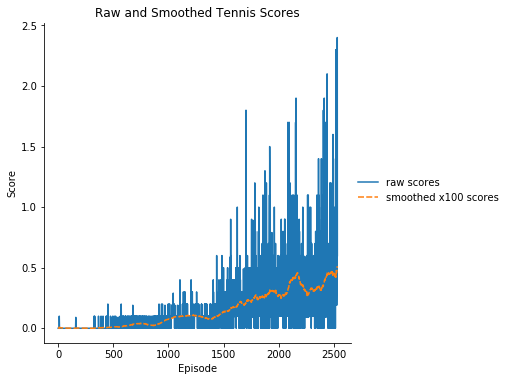

## Udacity Deep Reinforcement Learning Project 3 Report
#### Competition and Collaboration
## Introduction
This report describes the Competition and Collaboration project results using the Unity Tennis environment. This report demonstrates an implementation of the MADDPG algorithm is able to successfully complete the project requirements.

## Background
 The competition and collaboration project uses the Unity Tennis environment. The tennis project has two agents. Each agent receives its own observations about the state of the game in the form of a 24 dimensional vector. At each timestep, both agents take actions based upon their own state. The actions take the form of a two dimensional action that is continuous between -1.0 and 1.0. An agent is rewarded with 0.1 points for every ball hit over the net. An agent loses 0.01 points if the agent hits the ball out of bounds or lets the ball hit the ground. For each game, the score recorded is the maximum score among the two agents. The project requirement is for the average game score over 100 consecutive games to be greater than or equal to 0.5.
 
## Design
Below is the MADDPG algorithm defined in the [paper](https://arxiv.org/pdf/1706.02275.pdf).

	for episode = 1 to M do
		Initialize a random process N for action exploration
		Receive initial state x
		for t = 1 to max-episode-length do
			for each agent i, select action a[i] = mu(o) + Nt w.r.t the current policy and exploration
			Execute actions a = (a1...an) and observe reward r and new state x'
			Store (x,a,r,x') in replay buffer D
			x <- x'
			for agent i = 1 to N do
				Sample a random minibatch of S samples from D
				Set y = r + gamma*Q_target(x,a1,...an)
				Update critic by minimizing the loss
				L = 1/S SUM(y - Q_local)^2
				Update actor using the sampled policy gradient
				grad(J) = 1/S SUM(grad(mu) grad Q_local(x,a...an))
			end for
			Update target network parameters for each agent i
			theta = tau*theta + (1-tau)*theta'
		end for
	end for
			
## Implementation
### MADDPG Agent
The MADDPG Agent contains two instances of a DDPG Agent and also defines the Replay Buffer. The replay buffer is defined using a buffer size of 1e6 and a batch size of 256. 
### DDPG Agent
The DDPG Agent follows the actor critic model. The learning rate for the critic is set as 1e-3 and the learning rate for the actor is set as 1e-4. Both the actor and the critic employ two hidden layers of 400 and 300 units respectively. The actor only sees its own observations. Therefore the actor model looks like:
256x24 -> 256x400 -> 256x300 -> 256x2 

The critic sees the observations of both agents and the actions of both agents. The critic employs a batch normalization layer following the first fully-connected layer and it is the output of the batch normalization layer that is merged with the actions. Therefore, the critic model looks like:
256x48 -> 256x400 ->  256x404 -> 256x300 -> 256x1

### Other Hyperparameters
 * soft update hyperparameter tau set to 0.01
 * future rewards discount gamma set to 0.99

## Results
Below we can see that the implementation does indeed solve the problem and does so in 2379 steps.

Additionally, [the included trained tennis agent video](output/tennis_trained.mp4) illustrates the behavior after training.

## Future Work
The following techniques are worth pursuing for faster convergence or higher peak performance:

 * hyperparameter search 
 	* the mini-batch size of 256 slows computations versus a smaller batch size and it is likely unnecessary
 	* the learning rates selected may not be optimal and may result in slower convergence
 * architecture search
 	* it is possible that a deeper model or adding / removing units in each of the hidden layers may improve performance
 * prioritized experience replay
 	* replay of states and actions seen to be helpful to convergence may improve performance 
 

		